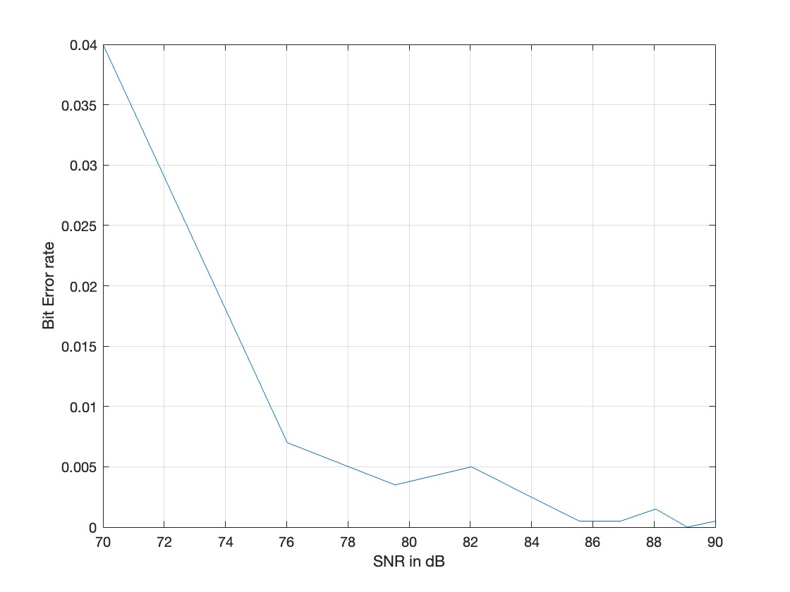

# Probability Of Error and Outage Probability

The aim is to determine the **probability of error** in the received signal and the **outage probability**, which checks if the received signal strength falls below a minimum threshold power. The outputs of the three channels are compared against their graphical outputs.

## Probability of Error
- It is described in terms of either symbol or bit errors.
- It depends on various factors:
    - Signal to Noise Ratio (SNR)
    - Type of Modulation used
    - Presence of Interference and Channel Characteristics

## Outage Probability
- The outage probability can be defined as the probability that the received signal-to-noise ratio (SNR) falls below a certain threshold, which is required to maintain a certain quality of service (QoS) at the receiver.
- It can be managed and controlled using :
    - Power Control
    - Adaptive Modulation and Coding
    - Diversity Techniques
    - Interference Management

## Types of Channels used for Comparison of __Probability of Error__ and __Outage Probability__
We have taken the following channels into consideration:

### Single Channel 
A single-channel wireless communication system refers to a system that uses a single channel for both the transmission and reception of data. This means that the same frequency band is used to send and receive data.
- **Expected Results:**
Single-channel system can be more susceptible to interference, noise, and other impairments, which can degrade the system’s performance and reliability.

### Three Channel
A three-channel system in wireless communication refers to a system that uses three separate channels for transmission and reception.
- **Expected Results:**
By using three independent channels with different frequency characteristics, the system can further reduce the impact of frequency-selective fading and other frequency-dependent impairments. This can improve system performance and reliability, particularly in severe channel conditions. A three-channel system is that it allows more efficient use of the available frequency spectrum. 

### Time-Varying Channel
A time-varying channel in wireless communication is a channel whose characteristics change over time due to various factors, such as the movement of the transmitter or receiver, changes in the environment, and interference from other sources.
- **Expected Results:**
Time-varying channels can cause significant impairments to wireless communication systems, such as signal attenuation, dispersion, and fading.

We look at the graphical outputs of the Bit Error Rates and Probability of Errors to complete out overall analysis on the three channels taken into consideration.